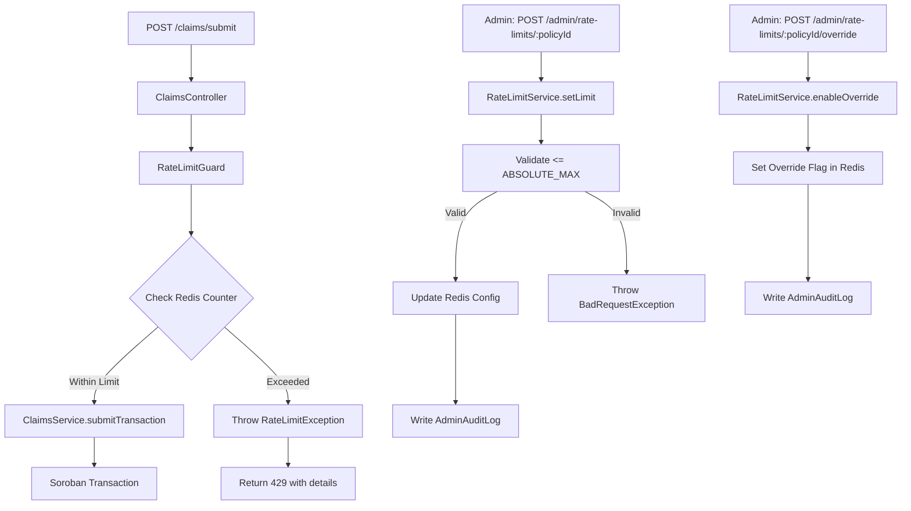
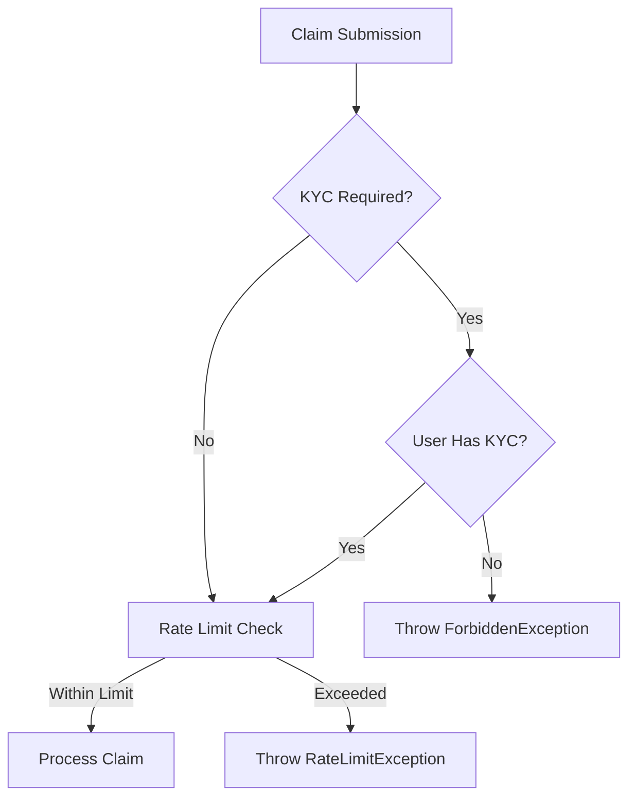

# Design Document: Claim Rate Limiting

## Overview

This design implements a rolling window rate limiting system for insurance claims to prevent spam and governance fatigue while preserving the ability to handle legitimate catastrophic events. The system:

1. Tracks claim counts per policy within configurable rolling time windows measured in ledgers
2. Enforces admin-configurable limits with hard-coded maximum bounds
3. Provides clear error messages when limits are exceeded
4. Maintains comprehensive audit logs of all configuration changes
5. Supports manual override capabilities for catastrophic events
6. Integrates with existing KYC systems for jurisdictional compliance
7. Maintains O(1) performance characteristics for normal operations

The implementation leverages Redis for fast counter operations and the existing AdminAuditLog infrastructure for compliance tracking.

---

## Architecture

The rate limiting system integrates into the existing claims filing flow as a pre-validation step:



Key architectural decisions:

- **Redis as primary storage**: All counters and configurations live in Redis for O(1) access. No database queries in the hot path.
- **Guard-based enforcement**: A NestJS guard intercepts claim submissions before they reach the service layer, keeping rate limiting concerns separated.
- **Ledger-based windows**: Windows are measured in ledgers (not wall-clock time) to align with blockchain finality and avoid clock skew issues.
- **Separate admin module**: Rate limit configuration lives in the admin controller alongside other operational controls.
- **Audit-first design**: Every configuration change writes to AdminAuditLog before taking effect.

---

## Components and Interfaces

### 1. RateLimitService (`backend/src/rate-limit/rate-limit.service.ts`)

Core service responsible for counter management and limit enforcement.

**Key Methods:**

```typescript
class RateLimitService {
  // Check if a claim can be filed, increment counter if allowed
  async checkAndIncrement(policyId: string, currentLedger: number): Promise<RateLimitCheckResult>;
  
  // Get current counter state for a policy
  async getCounterState(policyId: string): Promise<CounterState>;
  
  // Admin: set custom limit for a policy
  async setLimit(policyId: string, limit: number, actor: string): Promise<void>;
  
  // Admin: enable manual override for a policy
  async enableOverride(policyId: string, actor: string, reason: string): Promise<void>;
  
  // Admin: disable manual override for a policy
  async disableOverride(policyId: string, actor: string): Promise<void>;
  
  // Get effective limit for a policy (custom or default)
  async getEffectiveLimit(policyId: string): Promise<number>;
}

interface RateLimitCheckResult {
  allowed: boolean;
  currentCount: number;
  limit: number;
  windowAnchor: number;
  windowResetLedger: number;
  overrideActive: boolean;
}

interface CounterState {
  count: number;
  windowAnchor: number;
  limit: number;
  overrideActive: boolean;
}
```

**Redis Key Schema:**

```
rate_limit:counter:{policyId}        → hash { count, windowAnchor }
rate_limit:config:{policyId}         → hash { limit, overrideActive }
rate_limit:defaults                  → hash { defaultLimit, windowSize, absoluteMax }
```

**Window Reset Logic:**

```typescript
private async checkAndResetWindow(
  policyId: string,
  currentLedger: number,
): Promise<{ count: number; windowAnchor: number }> {
  const key = `rate_limit:counter:${policyId}`;
  const data = await this.redis.hgetall(key);
  
  if (!data.windowAnchor) {
    // First claim for this policy
    await this.redis.hset(key, { count: 0, windowAnchor: currentLedger });
    return { count: 0, windowAnchor: currentLedger };
  }
  
  const windowAnchor = parseInt(data.windowAnchor, 10);
  const windowSize = await this.getWindowSize();
  
  if (currentLedger >= windowAnchor + windowSize) {
    // Window expired, reset counter
    await this.redis.hset(key, { count: 0, windowAnchor: currentLedger });
    return { count: 0, windowAnchor: currentLedger };
  }
  
  // Window still active
  return { count: parseInt(data.count, 10), windowAnchor };
}
```

### 2. RateLimitGuard (`backend/src/rate-limit/rate-limit.guard.ts`)

NestJS guard that intercepts claim submission requests.

```typescript
@Injectable()
export class RateLimitGuard implements CanActivate {
  constructor(
    private readonly rateLimitService: RateLimitService,
    private readonly soroban: SorobanService,
  ) {}
  
  async canActivate(context: ExecutionContext): Promise<boolean> {
    const request = context.switchToHttp().getRequest();
    const { policyId } = request.body; // from SubmitTransactionDto
    
    if (!policyId) {
      // Let validation handle missing policyId
      return true;
    }
    
    const currentLedger = await this.soroban.getLatestLedger();
    const result = await this.rateLimitService.checkAndIncrement(policyId, currentLedger);
    
    if (!result.allowed) {
      throw new RateLimitException({
        policyId,
        currentCount: result.currentCount,
        limit: result.limit,
        windowResetLedger: result.windowResetLedger,
        remainingLedgers: result.windowResetLedger - currentLedger,
      });
    }
    
    return true;
  }
}
```

### 3. RateLimitException (`backend/src/rate-limit/rate-limit.exception.ts`)

Custom exception with detailed error information.

```typescript
export class RateLimitException extends HttpException {
  constructor(details: RateLimitErrorDetails) {
    const message = `Rate limit exceeded for policy ${details.policyId}. ` +
      `Current: ${details.currentCount}/${details.limit}. ` +
      `Window resets in ${details.remainingLedgers} ledgers (ledger ${details.windowResetLedger}).`;
    
    super(
      {
        statusCode: 429,
        error: 'Too Many Requests',
        message,
        details,
      },
      429,
    );
  }
}

interface RateLimitErrorDetails {
  policyId: string;
  currentCount: number;
  limit: number;
  windowResetLedger: number;
  remainingLedgers: number;
}
```

### 4. Admin Endpoints (`backend/src/admin/admin.controller.ts`)

New endpoints added to the existing AdminController:

```typescript
@Post('rate-limits/:policyId')
@ApiOperation({ summary: 'Set custom rate limit for a policy' })
async setRateLimit(
  @Param('policyId') policyId: string,
  @Body() dto: SetRateLimitDto,
  @Req() req: AdminRequest,
) {
  const actor = req.user?.walletAddress ?? 'unknown';
  await this.rateLimitService.setLimit(policyId, dto.limit, actor);
  await this.auditService.write({
    actor,
    action: 'rate_limit_set',
    payload: { policyId, limit: dto.limit },
    ipAddress: req.ip,
  });
  return { policyId, limit: dto.limit, status: 'updated' };
}

@Post('rate-limits/:policyId/override')
@ApiOperation({ summary: 'Enable manual override for a policy' })
async enableOverride(
  @Param('policyId') policyId: string,
  @Body() dto: EnableOverrideDto,
  @Req() req: AdminRequest,
) {
  const actor = req.user?.walletAddress ?? 'unknown';
  await this.rateLimitService.enableOverride(policyId, actor, dto.reason);
  await this.auditService.write({
    actor,
    action: 'rate_limit_override_enabled',
    payload: { policyId, reason: dto.reason },
    ipAddress: req.ip,
  });
  return { policyId, overrideActive: true };
}

@Delete('rate-limits/:policyId/override')
@ApiOperation({ summary: 'Disable manual override for a policy' })
async disableOverride(
  @Param('policyId') policyId: string,
  @Req() req: AdminRequest,
) {
  const actor = req.user?.walletAddress ?? 'unknown';
  await this.rateLimitService.disableOverride(policyId, actor);
  await this.auditService.write({
    actor,
    action: 'rate_limit_override_disabled',
    payload: { policyId },
    ipAddress: req.ip,
  });
  return { policyId, overrideActive: false };
}

@Get('rate-limits/:policyId')
@ApiOperation({ summary: 'Get rate limit status for a policy' })
async getRateLimitStatus(@Param('policyId') policyId: string) {
  return this.rateLimitService.getCounterState(policyId);
}
```

### 5. DTOs (`backend/src/admin/dto/rate-limit.dto.ts`)

```typescript
export class SetRateLimitDto {
  @IsInt()
  @Min(1)
  @Max(100) // ABSOLUTE_MAX_CAP
  limit!: number;
}

export class EnableOverrideDto {
  @IsString()
  @MinLength(10)
  reason!: string; // Require meaningful justification
}
```

### 6. Configuration Constants (`backend/src/rate-limit/rate-limit.constants.ts`)

```typescript
export const RATE_LIMIT_DEFAULTS = {
  DEFAULT_LIMIT: 5,              // claims per window
  WINDOW_SIZE_LEDGERS: 17_280,   // ~24 hours at 5s/ledger
  ABSOLUTE_MAX_CAP: 100,         // hard limit, cannot be exceeded
  CACHE_TTL_SECONDS: 300,        // 5 minutes for config cache
};
```

---

## Data Models

No new database tables are required. All rate limiting state lives in Redis for performance.

### Redis Data Structures

**Counter Hash** (`rate_limit:counter:{policyId}`):
```
{
  "count": "3",
  "windowAnchor": "12345678"
}
```

**Config Hash** (`rate_limit:config:{policyId}`):
```
{
  "limit": "10",
  "overrideActive": "false"
}
```

**Defaults Hash** (`rate_limit:defaults`):
```
{
  "defaultLimit": "5",
  "windowSize": "17280",
  "absoluteMax": "100"
}
```

### Audit Log Entries

Rate limiting actions are recorded in the existing `AdminAuditLog` table:

| Action                          | Payload Example                                                |
| ------------------------------- | -------------------------------------------------------------- |
| `rate_limit_set`                | `{ policyId: "GABC...123:1", limit: 10 }`                      |
| `rate_limit_override_enabled`   | `{ policyId: "GABC...123:1", reason: "Hurricane event" }`      |
| `rate_limit_override_disabled`  | `{ policyId: "GABC...123:1" }`                                 |
| `rate_limit_exceeded`           | `{ policyId: "GABC...123:1", count: 6, limit: 5 }` (optional) |

---

## Correctness Properties

_A property is a characteristic or behavior that should hold true across all valid executions of a system — essentially, a formal statement about what the system should do. Properties serve as the bridge between human-readable specifications and machine-verifiable correctness guarantees._

### Property 1: Counter increment on claim filing

_For any_ policy and any sequence of claim filings within a single window, the counter value after N claims should equal N.

**Validates: Requirements 1.1**

---

### Property 2: Window anchor exists for active policies

_For any_ policy that has had at least one claim filed, querying the counter state should return a valid window anchor ledger number greater than zero.

**Validates: Requirements 1.2**

---

### Property 3: Window reset round-trip

_For any_ policy with an active counter, if the current ledger advances beyond the window anchor plus window size, then checking the counter should reset it to zero and update the anchor to the current ledger.

**Validates: Requirements 1.3**

---

### Property 4: Rate limit enforcement at boundary

_For any_ policy with a configured limit L, filing L claims within a window should succeed, and the (L+1)th claim should be rejected with a rate limit error.

**Validates: Requirements 2.1**

---

### Property 5: Rate limit error completeness

_For any_ rate limit violation, the error response should contain the policy ID, current count, configured limit, window reset ledger, and remaining ledgers until reset.

**Validates: Requirements 2.2, 3.1, 3.4**

---

### Property 6: Admin configuration updates effective limit

_For any_ policy and any valid limit value (1 ≤ limit ≤ ABSOLUTE_MAX_CAP), setting the limit via the admin endpoint should cause subsequent rate limit checks to use that limit.

**Validates: Requirements 2.3**

---

### Property 7: Absolute max cap enforcement

_For any_ attempt to set a policy limit to a value greater than ABSOLUTE_MAX_CAP, the configuration change should be rejected with an error.

**Validates: Requirements 2.4, 2.5**

---

### Property 8: Default limit fallback

_For any_ policy without a custom limit configuration, the effective limit should equal the system default limit.

**Validates: Requirements 2.6**

---

### Property 9: Window reset calculation correctness

_For any_ window anchor ledger A and window size W, the calculated reset ledger should equal A + W.

**Validates: Requirements 3.2**

---

### Property 10: Audit log completeness for configuration changes

_For any_ admin action (setting limits, enabling overrides, disabling overrides), an audit log entry should be created containing the actor wallet address, action type, policy ID, relevant payload data, IP address, and timestamp.

**Validates: Requirements 4.1, 4.2, 4.3, 4.4, 5.3**

---

### Property 11: Override bypasses rate limits

_For any_ policy with manual override enabled, filing claims should succeed regardless of the counter value or configured limit.

**Validates: Requirements 5.1**

---

### Property 12: Override enable/disable round-trip

_For any_ policy, enabling override then disabling override should return the policy to standard rate limiting behavior where limits are enforced.

**Validates: Requirements 5.2, 5.5**

---

### Property 13: KYC check precedes rate limiting

_For any_ policy in a jurisdiction requiring KYC, if the user lacks KYC verification, the claim should be rejected with a KYC error before rate limit checks are performed.

**Validates: Requirements 8.1, 8.2, 8.3, 8.4**

---

## Error Handling

| Scenario                                  | Behavior                                                                                                                                                                |
| ----------------------------------------- | ----------------------------------------------------------------------------------------------------------------------------------------------------------------------- |
| Rate limit exceeded                       | Throw `RateLimitException` (HTTP 429) with detailed error message including current count, limit, and window reset information                                         |
| Admin sets limit > ABSOLUTE_MAX_CAP       | Throw `BadRequestException` (HTTP 400) with message: "Limit cannot exceed absolute maximum of {ABSOLUTE_MAX_CAP}"                                                      |
| Admin sets limit < 1                      | Throw `BadRequestException` (HTTP 400) with message: "Limit must be at least 1"                                                                                        |
| Redis connection failure                  | Throw `ServiceUnavailableException` (HTTP 503) with message: "Rate limiting service temporarily unavailable"                                                           |
| Policy not found                          | Allow claim to proceed (fail open) and log warning. Rate limiting should not block legitimate claims due to data inconsistencies                                       |
| KYC verification required but not present | Throw `ForbiddenException` (HTTP 403) with message: "KYC verification required for this jurisdiction" (before rate limit check)                                        |
| Invalid policyId format                   | Let existing validation handle it (guard returns true, validation layer rejects)                                                                                       |
| Concurrent claims at limit boundary       | Redis HINCRBY is atomic, so exactly one claim will succeed and others will be rejected. No race condition                                                              |
| Override enabled with no reason           | Throw `BadRequestException` (HTTP 400) with message: "Override reason must be at least 10 characters"                                                                  |

**Fail-Open Philosophy**: If Redis is unavailable or data is inconsistent, the system should allow claims to proceed rather than blocking legitimate users. Rate limiting is a spam prevention measure, not a critical security control.

---

## Testing Strategy

### Dual Testing Approach

Both unit/integration tests and property-based tests are used. They are complementary:

- **Unit tests** (Jest): Verify specific examples, edge cases, error messages, and integration with existing services
- **Property-based tests** (Jest + `fast-check`): Verify universal properties across randomly generated inputs, catching edge cases that hand-written examples miss

`fast-check` is the property-based testing library for TypeScript/JavaScript. It integrates directly with Jest via `fc.assert(fc.property(...))` and requires no additional test runner.

Install: `npm install --save-dev fast-check` (if not already present)

### Test File Layout

```
backend/src/rate-limit/__tests__/
  rate-limit.service.test.ts          # unit tests for service methods
  rate-limit.guard.test.ts            # integration tests for guard
  rate-limit.property.test.ts         # property-based tests
  rate-limit-admin.test.ts            # admin endpoint integration tests
```

### Unit Tests

**Service Tests** (`rate-limit.service.test.ts`):
1. Counter increments correctly for sequential claims
2. Window resets when ledger exceeds anchor + window size
3. Custom limit overrides default limit
4. Override flag bypasses rate limiting
5. Error thrown when limit exceeded
6. Error thrown when setting limit > ABSOLUTE_MAX_CAP
7. Audit log written on configuration change
8. Redis failure causes fail-open behavior

**Guard Tests** (`rate-limit.guard.test.ts`):
1. Guard allows claim when under limit
2. Guard blocks claim when at limit
3. Guard throws RateLimitException with correct details
4. Guard passes through when policyId missing (lets validation handle it)

**Admin Endpoint Tests** (`rate-limit-admin.test.ts`):
1. POST /admin/rate-limits/:policyId sets custom limit
2. POST /admin/rate-limits/:policyId with limit > max returns 400
3. POST /admin/rate-limits/:policyId/override enables override
4. DELETE /admin/rate-limits/:policyId/override disables override
5. GET /admin/rate-limits/:policyId returns current state
6. All admin actions require authentication (401 without JWT)
7. All admin actions require admin role (403 without admin role)
8. All admin actions write audit logs

### Property-Based Tests

Each test runs a minimum of 100 iterations. Tests use `fast-check` generators to create random inputs.

**Property Test 1: Counter increment**
```typescript
// Feature: claim-rate-limiting, Property 1: Counter increment on claim filing
fc.assert(fc.property(
  fc.string(), // policyId
  fc.integer({ min: 1, max: 20 }), // number of claims
  fc.integer({ min: 1000000, max: 2000000 }), // starting ledger
  async (policyId, numClaims, startLedger) => {
    // File numClaims claims, verify counter equals numClaims
  }
), { numRuns: 100 });
```

**Property Test 2: Window anchor exists**
```typescript
// Feature: claim-rate-limiting, Property 2: Window anchor exists for active policies
fc.assert(fc.property(
  fc.string(), // policyId
  fc.integer({ min: 1000000, max: 2000000 }), // ledger
  async (policyId, ledger) => {
    // File one claim, verify window anchor > 0
  }
), { numRuns: 100 });
```

**Property Test 3: Window reset round-trip**
```typescript
// Feature: claim-rate-limiting, Property 3: Window reset round-trip
fc.assert(fc.property(
  fc.string(), // policyId
  fc.integer({ min: 1000000, max: 2000000 }), // start ledger
  fc.integer({ min: 1, max: 10 }), // initial claims
  async (policyId, startLedger, initialClaims) => {
    // File claims, advance ledger past window, verify counter reset
  }
), { numRuns: 100 });
```

**Property Test 4: Rate limit enforcement**
```typescript
// Feature: claim-rate-limiting, Property 4: Rate limit enforcement at boundary
fc.assert(fc.property(
  fc.string(), // policyId
  fc.integer({ min: 1, max: 20 }), // limit
  fc.integer({ min: 1000000, max: 2000000 }), // ledger
  async (policyId, limit, ledger) => {
    // Set limit, file limit claims (should succeed), file one more (should fail)
  }
), { numRuns: 100 });
```

**Property Test 5: Error completeness**
```typescript
// Feature: claim-rate-limiting, Property 5: Rate limit error completeness
fc.assert(fc.property(
  fc.string(), // policyId
  fc.integer({ min: 1, max: 10 }), // limit
  fc.integer({ min: 1000000, max: 2000000 }), // ledger
  async (policyId, limit, ledger) => {
    // Trigger rate limit, verify error contains all required fields
  }
), { numRuns: 100 });
```

**Property Test 6: Admin configuration**
```typescript
// Feature: claim-rate-limiting, Property 6: Admin configuration updates effective limit
fc.assert(fc.property(
  fc.string(), // policyId
  fc.integer({ min: 1, max: 100 }), // limit
  async (policyId, limit) => {
    // Set limit via admin, verify effective limit equals set value
  }
), { numRuns: 100 });
```

**Property Test 7: Absolute max cap**
```typescript
// Feature: claim-rate-limiting, Property 7: Absolute max cap enforcement
fc.assert(fc.property(
  fc.string(), // policyId
  fc.integer({ min: 101, max: 1000 }), // limit > ABSOLUTE_MAX_CAP
  async (policyId, limit) => {
    // Attempt to set limit, verify rejection
  }
), { numRuns: 100 });
```

**Property Test 8: Default limit fallback**
```typescript
// Feature: claim-rate-limiting, Property 8: Default limit fallback
fc.assert(fc.property(
  fc.string(), // policyId (no custom config)
  async (policyId) => {
    // Get effective limit, verify it equals DEFAULT_LIMIT
  }
), { numRuns: 100 });
```

**Property Test 9: Window reset calculation**
```typescript
// Feature: claim-rate-limiting, Property 9: Window reset calculation correctness
fc.assert(fc.property(
  fc.integer({ min: 1000000, max: 2000000 }), // anchor
  fc.integer({ min: 1000, max: 50000 }), // window size
  (anchor, windowSize) => {
    // Calculate reset ledger, verify it equals anchor + windowSize
  }
), { numRuns: 100 });
```

**Property Test 10: Audit log completeness**
```typescript
// Feature: claim-rate-limiting, Property 10: Audit log completeness for configuration changes
fc.assert(fc.property(
  fc.string(), // policyId
  fc.integer({ min: 1, max: 100 }), // limit
  fc.constantFrom('rate_limit_set', 'rate_limit_override_enabled', 'rate_limit_override_disabled'),
  async (policyId, limit, action) => {
    // Perform admin action, verify audit log entry exists with all fields
  }
), { numRuns: 100 });
```

**Property Test 11: Override bypasses limits**
```typescript
// Feature: claim-rate-limiting, Property 11: Override bypasses rate limits
fc.assert(fc.property(
  fc.string(), // policyId
  fc.integer({ min: 1, max: 10 }), // limit
  fc.integer({ min: 11, max: 50 }), // claims to file (exceeds limit)
  fc.integer({ min: 1000000, max: 2000000 }), // ledger
  async (policyId, limit, numClaims, ledger) => {
    // Enable override, file numClaims claims, verify all succeed
  }
), { numRuns: 100 });
```

**Property Test 12: Override enable/disable round-trip**
```typescript
// Feature: claim-rate-limiting, Property 12: Override enable/disable round-trip
fc.assert(fc.property(
  fc.string(), // policyId
  fc.integer({ min: 1, max: 10 }), // limit
  async (policyId, limit) => {
    // Enable override, disable override, verify rate limiting is enforced
  }
), { numRuns: 100 });
```

**Property Test 13: KYC check precedes rate limiting**
```typescript
// Feature: claim-rate-limiting, Property 13: KYC check precedes rate limiting
fc.assert(fc.property(
  fc.string(), // policyId
  fc.string(), // userAddress (no KYC)
  async (policyId, userAddress) => {
    // Attempt claim without KYC, verify KYC error (not rate limit error)
  }
), { numRuns: 100 });
```

### Integration Test Coverage

Integration tests verify the full request/response cycle:

1. **Approach limit**: File 4 claims with limit=5, verify all succeed
2. **Exceed by one**: File 5 claims with limit=5, verify 5th succeeds and 6th fails
3. **Window rollover**: File claims, advance ledger past window, verify counter reset
4. **Concurrent claims**: Use Promise.all to file multiple claims simultaneously at boundary
5. **Normal usage unaffected**: File single claim well under limit, verify no added latency

### Test Data Generators

Custom `fast-check` arbitraries for domain objects:

```typescript
const policyIdArb = fc.string({ minLength: 10, maxLength: 100 });
const ledgerArb = fc.integer({ min: 1_000_000, max: 10_000_000 });
const limitArb = fc.integer({ min: 1, max: 100 });
const walletAddressArb = fc.string({ minLength: 56, maxLength: 56 }); // Stellar address
```

---

## KYC Integration

The rate limiting system integrates with KYC verification as a pre-check before rate limit enforcement.

### KYC Check Flow



### KYC Service Interface

```typescript
interface KYCService {
  // Check if KYC is required for a policy's jurisdiction
  isKYCRequired(policyId: string): Promise<boolean>;
  
  // Check if a user has completed KYC
  hasKYCVerification(walletAddress: string): Promise<boolean>;
  
  // Get jurisdiction for a policy
  getJurisdiction(policyId: string): Promise<string>;
}
```

### Implementation Notes

- KYC checks are performed in the `RateLimitGuard` before rate limit checks
- KYC failures are logged separately in the audit log with action `kyc_verification_failed`
- KYC requirements are configured per jurisdiction in a separate configuration table
- If KYC service is unavailable, the system fails open (allows claim) and logs a warning
- KYC verification status is cached in Redis for 5 minutes to reduce database load

---

## Operational Considerations

### Default Configuration

The system ships with these defaults (defined in `rate-limit.constants.ts`):

```typescript
export const RATE_LIMIT_DEFAULTS = {
  DEFAULT_LIMIT: 5,              // 5 claims per window
  WINDOW_SIZE_LEDGERS: 17_280,   // ~24 hours (17,280 ledgers × 5s/ledger)
  ABSOLUTE_MAX_CAP: 100,         // Hard limit, cannot be exceeded
  CACHE_TTL_SECONDS: 300,        // 5 minutes for config cache
};
```

### Recommended Limits by Policy Type

These are suggested starting points based on typical usage patterns:

| Policy Type          | Recommended Limit | Rationale                                                                 |
| -------------------- | ----------------- | ------------------------------------------------------------------------- |
| Standard Property    | 5 per 24h         | Most properties have 1-2 incidents per year                               |
| High-Value Property  | 3 per 24h         | Stricter limits for high-value policies to prevent fraud                  |
| Catastrophic Event   | 20 per 24h        | Natural disasters may cause multiple legitimate claims                    |
| Test/Development     | 100 per 24h       | Maximum allowed for testing purposes                                      |

Administrators should coordinate with legal and product teams before adjusting limits.

### Manual Override Procedures

Manual overrides should be used sparingly and only for documented catastrophic events:

1. **Activation**: Admin calls `POST /admin/rate-limits/:policyId/override` with a detailed reason (minimum 10 characters)
2. **Documentation**: The reason is stored in the audit log and should reference an incident ticket or event
3. **Monitoring**: Overrides should be reviewed daily and disabled once the event is resolved
4. **Deactivation**: Admin calls `DELETE /admin/rate-limits/:policyId/override` when normal operations resume

**Legal Note**: Manual overrides constitute a staff-initiated modification of policy terms. Such actions must be authorized by a designated compliance officer and documented in accordance with insurance regulations.

### Redis Key Expiration

Rate limit counters do not use Redis TTL expiration. Instead, they are reset programmatically when the window expires. This ensures:

- Counters persist across Redis restarts
- Window boundaries are deterministic and based on ledger numbers
- No race conditions between TTL expiration and counter checks

Configuration keys (`rate_limit:config:{policyId}`) also do not expire and must be explicitly deleted if a policy is removed.

### Monitoring and Alerts

Recommended monitoring:

1. **Rate limit hit rate**: Track percentage of claims rejected due to rate limiting
2. **Override usage**: Alert when overrides are active for >48 hours
3. **Configuration changes**: Alert on any limit changes >50% of previous value
4. **Redis availability**: Alert if Redis connection fails (system will fail open)
5. **Audit log gaps**: Alert if no audit entries for >24 hours (indicates logging failure)

### Performance Characteristics

Expected performance under normal load:

- **Rate limit check latency**: <5ms (Redis HGET + HINCRBY)
- **Configuration lookup**: <2ms (cached in memory)
- **Admin configuration change**: <50ms (Redis write + database audit log write)
- **Window reset**: <10ms (Redis HSET with new anchor)

Redis memory usage:

- **Per-policy counter**: ~100 bytes (hash with 2 fields)
- **Per-policy config**: ~80 bytes (hash with 2 fields)
- **1000 active policies**: ~180 KB total

### Disaster Recovery

If Redis data is lost:

1. All counters reset to zero (policies start with fresh windows)
2. Custom configurations are lost (all policies revert to default limit)
3. Override flags are lost (all policies revert to standard rate limiting)

To mitigate:

- Enable Redis persistence (RDB snapshots + AOF)
- Back up Redis data daily
- Store critical configurations in the database as a backup (future enhancement)

### Migration Path

For existing deployments:

1. Deploy the rate limiting service with `DEFAULT_LIMIT` set high (e.g., 50) to avoid disrupting existing users
2. Monitor rate limit hit rates for 1 week
3. Gradually lower the default limit based on observed usage patterns
4. Communicate changes to users via email/dashboard notifications

---

## Future Enhancements

Potential improvements not included in this initial implementation:

1. **Per-user rate limiting**: Track claims per user across all policies
2. **Dynamic limits**: Adjust limits based on policy holder reputation or claim history
3. **Graduated limits**: Different limits for different time windows (e.g., 5/day, 20/month)
4. **Rate limit analytics dashboard**: Visualize rate limit hits and trends
5. **Automatic override detection**: ML-based detection of catastrophic events to auto-enable overrides
6. **Database-backed configuration**: Store custom limits in PostgreSQL for durability
7. **Multi-region coordination**: Sync rate limits across multiple Redis instances
8. **Claim priority queuing**: Allow high-priority claims to bypass rate limits

---

## Security Considerations

### Threat Model

**Threats Mitigated:**
- **Spam attacks**: Malicious users filing excessive claims to overwhelm governance
- **Governance fatigue**: Legitimate users filing too many claims, exhausting voter attention
- **Economic attacks**: Attackers attempting to drain policy funds via rapid claims

**Threats Not Mitigated:**
- **Sybil attacks**: Attacker creates multiple policies to bypass per-policy limits (requires per-user limiting)
- **Distributed attacks**: Coordinated attack across many legitimate policies (requires anomaly detection)
- **Replay attacks**: Resubmitting valid claim transactions (handled by blockchain nonce mechanism)

### Access Control

- **Rate limit checks**: No authentication required (public endpoint)
- **Admin configuration**: Requires JWT authentication + admin role
- **Audit log access**: Requires JWT authentication + admin role
- **Override operations**: Requires JWT authentication + admin role + reason documentation

### Audit Trail

All administrative actions are logged immutably in the `AdminAuditLog` table:

- Actor wallet address
- Action type
- Full payload (for forensic replay)
- IP address
- Timestamp

Audit logs are append-only and must never be updated or deleted.

---

## Dependencies

### New Dependencies

```json
{
  "dependencies": {
    "@nestjs/throttler": "^5.0.0"  // For HTTP-level rate limiting (separate from claim rate limiting)
  },
  "devDependencies": {
    "fast-check": "^3.15.0"  // Property-based testing library
  }
}
```

### Existing Dependencies

- `@nestjs/common`: Exception handling, guards, decorators
- `@nestjs/config`: Configuration management
- `ioredis`: Redis client (already used for caching)
- `@prisma/client`: Audit log persistence
- `jest`: Test framework
- `supertest`: HTTP integration testing

---

## Deployment Checklist

Before deploying to production:

- [ ] Redis persistence enabled (RDB + AOF)
- [ ] Redis memory limit configured (recommend 1GB minimum)
- [ ] Redis eviction policy set to `noeviction` (prevent data loss)
- [ ] `RATE_LIMIT_DEFAULTS` reviewed and approved by product + legal
- [ ] Admin authentication and authorization tested
- [ ] Audit logging verified in production environment
- [ ] Monitoring alerts configured for rate limit metrics
- [ ] Runbook created for manual override procedures
- [ ] User-facing documentation updated with rate limit information
- [ ] Load testing completed with expected claim volumes
- [ ] Rollback plan documented in case of issues

---

## Glossary

- **Rolling Window**: A time-based window measured in ledgers that slides forward as new claims are filed
- **Window Anchor**: The ledger number marking the start of the current rolling window for a policy
- **Claim Counter**: The number of claims filed for a policy within the current rolling window
- **Absolute Max Cap**: A hard-coded system maximum (100) that cannot be exceeded by admin configuration
- **Manual Override**: An admin-activated mode that allows claims to bypass rate limits during catastrophic events
- **Fail Open**: A design philosophy where system failures (e.g., Redis unavailable) allow operations to proceed rather than blocking users
- **Ledger**: A Stellar blockchain block, produced approximately every 5 seconds
- **Property-Based Testing**: A testing methodology that verifies universal properties across randomly generated inputs

---

## References

- [Stellar Ledger Documentation](https://developers.stellar.org/docs/learn/fundamentals/ledgers)
- [Redis HINCRBY Command](https://redis.io/commands/hincrby/)
- [NestJS Guards](https://docs.nestjs.com/guards)
- [fast-check Documentation](https://fast-check.dev/)
- [Rate Limiting Patterns](https://en.wikipedia.org/wiki/Rate_limiting)
- [EARS Requirements Notation](https://alistairmavin.com/ears/)

---

## Document History

| Version | Date       | Author | Changes                          |
| ------- | ---------- | ------ | -------------------------------- |
| 1.0     | 2024-01-XX | AI     | Initial design document created  |

